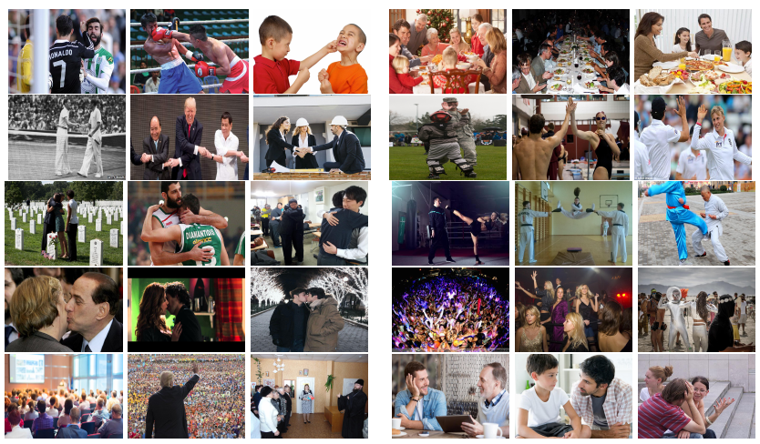

# Multi-stream Pose Convolutional Neural Networks for Human Interaction Recognition in Images
Recognizing human interactions in still images is quite a challenging task since compared to videos, there is only a glimpse of interaction in a single image. This work investigates the role of human poses in recognizing human-human interactions in still images. To this end, a multi-stream convolutional neural network architecture is proposed, which fuses different levels of human pose information to recognize human interactions better. In this context, several pose-based representations are explored. Experimental evaluations in an extended benchmark dataset show that the proposed multi-stream pose Convolutional Neural Network is successful in discriminating a wide range of human-human interactions and human poses when used in conjunction with the overall context provides discriminative cues about human-human interactions.

## Dataset Examples
To evaluate our method, we have extended already existing HII dataset. There are 10502 images in this extended dataset. The available set of classes is the same with the HII dataset, where the classes are boxing-punching, dining, handshaking, high five, hugging, kicking, kissing, partying, speech and talking, respectively. We call this new version of HII dataset as Human Interaction Images v2 (HIIv2). Different from the HII dataset, which focus on human faces, HIIv2 focuses on human poses as the primary feature set. Therefore, faces in HIIv2 are not annotated as in the HII dataset.

The figure below illustrates example images from this dataset. Two example images are shown for each of the ten classes for this dataset, boxing-punching, dining, handshaking, highfive, hugging, kicking, kissing, partying, speech and talking. Note that, the poses and appearances of the people in interaction is quite diverse, making it a challenging dataset.

## Dataset
Human Interaction Images v2 (HIIv2) dataset will be made available upon publication of the paper.

## Reference
To be defined.

## Acknowledgment
This work was supported in part by the Scientific and Technological Research Council of Turkey (TUBITAK) Career Development Award numbered 112E149.

Please direct any questions to gokhantanisik -at- cs dot hacettepe dot edu dot tr
