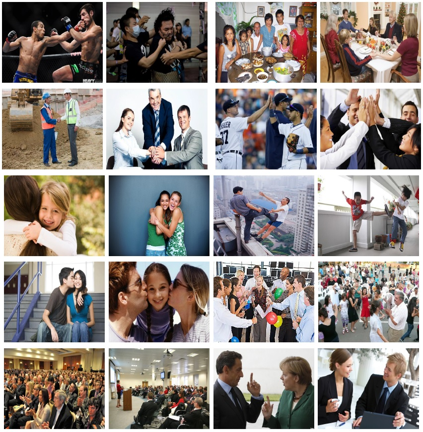

# Facial Descriptors for Human Interaction Recognition In Still Images
This paper presents a novel approach in a rarely studied area of computer vision: Human interaction recognition in still images. We explore whether the facial regions and their spatial configurations contribute to the recognition of interactions. In this respect, our method involves extraction of several visual features from the facial regions, as well as incorporation of scene characteristics and deep features to the recognition. Extracted multiple features are utilized within a discriminative learning framework for recognizing interactions between people. Our designed facial descriptors are based on the observation that relative positions, size and locations of the faces are likely to be important for characterizing human interactions. Since there is no available dataset in this relatively new domain, a comprehensive new dataset which includes several images of human interactions is collected. Our experimental results show that faces and scene characteristics contain important information to recognize interactions between people.

## Dataset Examples
In order to evaluate the proposed facial descriptors and their effect on human-human interaction recognition, we collected a new image dataset that includes ten human interaction classes. These classes are boxing-punching, dining, handshaking, highfive, hugging, kicking, kissing, partying, speech and talking. Each class contains at least 150 images, forming a total of 1972 images. When collecting the dataset, we gather images such that one of the target interaction classes is present and at least one person has a visible facial region in each image. The images for the boxing-punching, handshaking, highfive, hugging, kicking, kissing and talking classes usually include two to three people, whereas the number of people in the images for the dining, party and speech classes vary significantly.

The figure below illustrates example images from this dataset. Two example images are shown for each of the ten classes for this dataset, boxing-punching, dining, handshaking, highfive, hugging, kicking, kissing, partying, speech and talking. Note that, the poses and appearances of the people in interaction is quite diverse, making it a challenging dataset.


## Dataset
Human Interaction Images (HII) dataset can be downloaded from [here](https://vision.cs.hacettepe.edu.tr/interaction_images/Facial_Descriptors_files/facial_descriptors_dataset.zip), and the annotations for the dataset can be downloaded from [here](https://vision.cs.hacettepe.edu.tr/interaction_images/Facial_Descriptors_files/facial_descriptors_dataset_annotations.zip).

HIIv2 is also available [here](https://gtanisik.github.io/projects/hiiv2).

## Paper

* Facial descriptors for human interaction recognition in still images [[original paper](http://www.sciencedirect.com/science/article/pii/S0167865516000064)] [[arXiv Pre-print](http://arxiv.org/abs/1509.05366)]

```
    @article{TANISIK201644,
        title     = {Facial descriptors for human interaction recognition in still images},
        journal   = {Pattern Recognition Letters},
        volume    = {73},
        pages     = {44-51},
        year      = {2016},
        issn      = {0167-8655},
        doi       = {https://doi.org/10.1016/j.patrec.2016.01.002},
        url       = {https://www.sciencedirect.com/science/article/pii/S0167865516000064},
        author    = {Gokhan Tanisik and Cemil Zalluhoglu and Nazli Ikizler-Cinbis},
        keywords  = {Human interaction recognition, Facial features, Interaction recognition in still images}
    }
```

* Multi-stream pose convolutional neural networks for human interaction recognition in images [[web site](https://gtanisik.github.io/projects/hiiv2)][paper](https://www.sciencedirect.com/science/article/pii/S0923596521001119?dgcid=author)

```
    @article{TANISIK2021116265,
        title     = {Multi-stream pose convolutional neural networks for human interaction recognition in images},
        journal   = {Signal Processing: Image Communication},
        volume    = {95},
        pages     = {116265},
        year      = {2021},
        issn      = {0923-5965},
        doi       = {https://doi.org/10.1016/j.image.2021.116265},
        url       = {https://www.sciencedirect.com/science/article/pii/S0923596521001119},
        author    = {Gokhan Tanisik and Cemil Zalluhoglu and Nazli Ikizler-Cinbis},
        keywords  = {Human–human interactions, Convolutional neural networks, Poses}
    }
```

## Acknowledgment
This work was supported in part by the Scientific and Technological Research Council of Turkey (TUBITAK) Career Development Award numbered 112E149.

Please direct any questions to gokhantanisik -at- cs dot hacettepe dot edu dot tr
